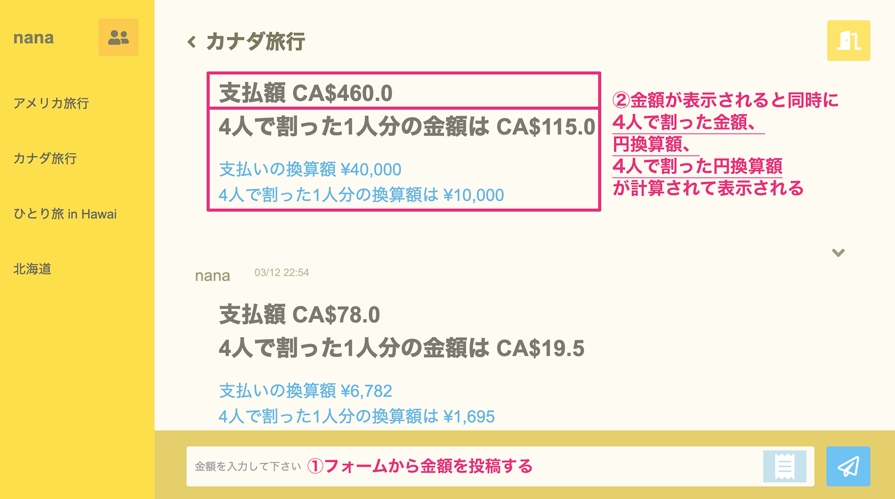
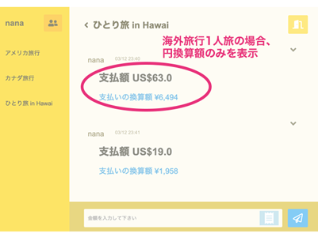

## アプリ名  You owe me

# 概要
旅行中にシェアしたお金やレシートをチャット形式で管理ができるアプリです。また、グループ上で金額を投稿すると、一人分の金額と円換算金額の結果が表示され、計算の手間を省くことができます。
**貴重な旅行の時間を最大限に楽しむため**に、お金のシェア時に生じる必要な工程を最短で行えるよう1つのアプリにまとめ、容易に漏れなく管理ができます。

# :airplane: 制作背景
私は旅行が好きでよく友人と海外旅行へ行きます。その際に様々なシチュエーションでお金のシェアをすることがあり、**限られた旅行の時間の中で素早くしっかりお金の管理ができるアプリがあればより旅行が楽しめるのではないか**と考えYou owe meを作成しました。
実際に旅行中のお金のシェアをするタイミングを洗い出すと以下の3点が挙げられます。
1. アプリでの支払いはクレジット払いが多く、人数分の航空券や宿泊代、uber代などを誰か一人が代表して支払うことがあった
2. お土産購入時に「10こ購入すると5こ無料」などの割引商品を友人とシェアすることがあった
3. 両替所がすぐに見つからない時や、現地の通貨があまりすぎて使い切りたい友人と、現地の通貨が足り無くて友人内でのお金の貸し借りがあった

## 問題点となっていたこと
- シェア代を受け持った際に、レートの確認、金額の計算、メモをする工程が手間であること
- レシートを写真で残すが観光時に撮影した写真のデータに埋もれた中から探すのは手間であること
- 旅行中の口頭だけでのやり取りは忘れることがあること
- お金の請求は友人でも催促がしにくいこと

# :bulb: このアプリが解決できること
- シェアしたお金やレシートを1つのアプリでまとめて管理できること
- 計算せずとも一人分の金額が表示される事
- シェアした同士で可視化でき安心なこと、支払いが済んでいない場合にアプリが通知をしてくれること
- 電子や円で支払う場合でも円換算金額がすぐに確認できること
- **時間をかけずシェアしたお金のメモができることで旅行を存分に楽しめること**
 

## アプリの仕様
### シェアしたい相手とのグループルームを作成 
   

### 投稿後の表示の詳細（カナダ旅行中の4人のユーザーで作成されたグループルーム） 
 

### 削除ボタンの詳細 
 

### レシートも投稿可能 
 

## :point_up: 工夫したポイント
お金を返し忘れている際はアプリから通知が届くようにOneSignal APIの導入をしました。
  
   
また、国内旅行や友人とのパーティーの打ち分け、1人旅、個人的な買い物のメモとしてもYou owe meを活用できるよう、シチュエーションに合わせた条件分岐の記述を行い、計算表示部分の必要な情報のみを表示できるようにしました。  
 

## 🌐 App URL
### https://you-owe-me.herokuapp.com  
※herokuでのプロイをしているため、herokuへのログインが必要となります。下記のアプリの仕様にて画像を用いたアプリケーションの説明を記述しておりますのでそちらもご覧頂けると幸いです。

### ユーザー認証
- ユーザーネーム s6quma
- パスワード 1111
### テストアカウント
- テストEメール na@gmail.com
- パスワード nanana7

## :open_file_folder: 使用技術(開発環境)
HTML / CSS / Ruby / Ruby on Rails / MySQL / GitHub / Heroku / Visual Studio Code / Trello / OneSignal API
 

## 課題や今後実装したい機能
- 非同期通信を行えるようにし、投稿時のストレスを減らす
- アプリから直接写真を撮影できる仕様にする
- 通知設定の細かな設定
- 合計金額を表示できるような設定を作る
- メッセージも投稿可能にする
 

## テーブル設計

## users テーブル

| Column   | Type   | Options     |
| -------- | ------ | ----------- |
| name     | string | null: false |
| email    | string | null: false |
| password | string | null: false |

### Association

- has_many :room_users
- has_many :rooms, through: room_users
- has_many :messages

## rooms テーブル

| Column      | Type    | Options     |
| ----------- | ------- | ----------- |
| name        | string  | null: false |
| manager     | integer | null: false |
| price       | float   | null: false |
| currency_id | integer | null: false |

### Association

- has_many :room_users
- has_many :users, through: room_users
- has_many :messages
(Active hash)
- belongs_to :currency

## room_users テーブル

| Column | Type       | Options                        |
| ------ | ---------- | ------------------------------ |
| user   | references | null: false, foreign_key: true |
| room   | references | null: false, foreign_key: true |

### Association

- belongs_to :room
- belongs_to :user

## messages テーブル

| Column  | Type       | Options                        |
| ------- | ---------- | ------------------------------ |
| content | string     |                                |
| user    | references | null: false, foreign_key: true |
| room    | references | null: false, foreign_key: true |

### Association

- belongs_to :room
- belongs_to :user

(Active hash)
- currency

